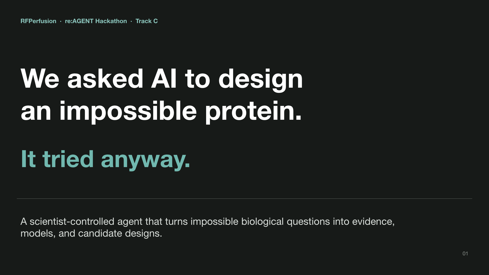
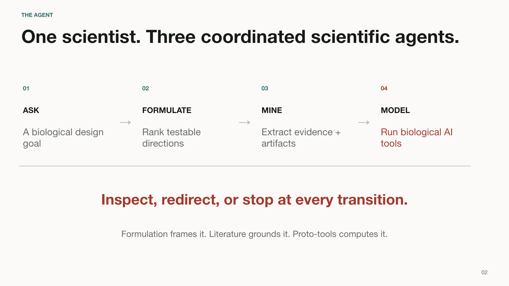
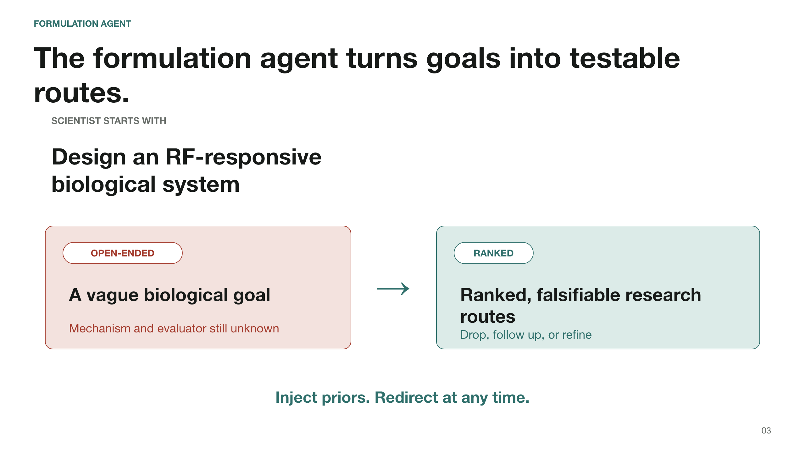
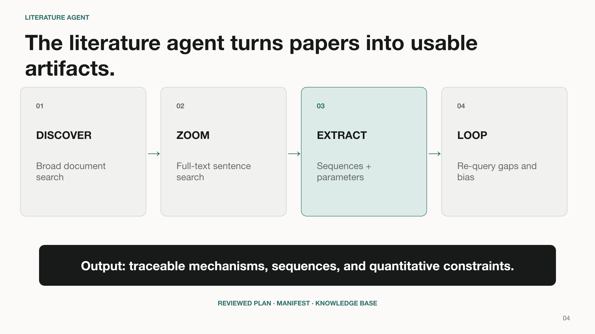
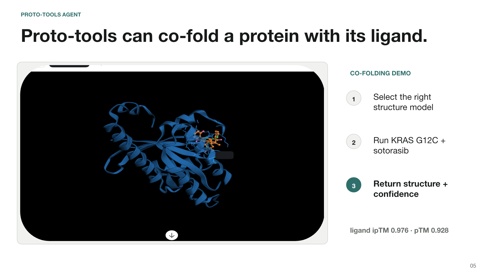
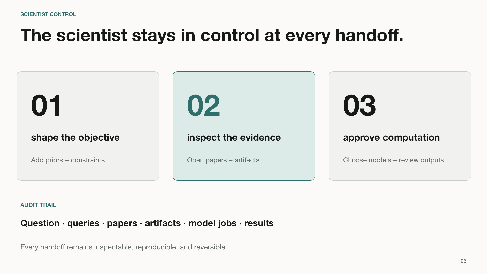

# RFPerfusion

RFPerfusion combines project design documents, literature-search tooling, and a Modal-backed proto-tools integration.

## Hackathon pitch

[PowerPoint deck](RFPerfusion_Hackathon_Pitch_Final.pptx) · [PDF deck](output/pdf/RFPerfusion_Hackathon_Pitch_Final.pdf)














## Repository layout

- `docs/` — project requirements and design notes.
- `litterature_search_from_concept/` — the existing literature-search workflow.
- `formulation_agent/` — turns an open design question into ranked research directions, with every claim verified against full-text literature. Browser UI or terminal; see its [README](formulation_agent/README.md).
- `proto/` — the isolated uv runtime for proto-tools. Generated results go to the gitignored `proto/outputs/` directory.
- `.claude/skills/proto-tools/` — instructions that teach Claude and compatible agents how to discover, deploy, and run proto-tools.
- `.claude/skills/mine-literature-from-concept/` — broad concept-to-corpus literature reconnaissance with reproducible artifacts.
- `.claude/skills/formulate-grounded-directions/` — ranked research formulation with claim-level literature verification.
- `.agents` — a symlink to `.claude`, so the same skill works with agents that use either convention.
- `.mcp.json` — the project-scoped MCP server configuration.

## Formulation agent

From the repository root:

```bash
codex login                                # one-time subscription sign-in
export FA_LLM_BACKEND=codex                # default; or: claude
uv run --project formulation_agent formulate-web
```

Opens a local browser UI. `formulate` runs the same engine in the terminal.
For Claude, run `claude auth login` once and set `FA_LLM_BACKEND=claude`.
Details, guarantees and known corpus limitations: [formulation_agent/README.md](formulation_agent/README.md).

## Proto-tools setup

From the repository root:

```bash
uv sync --project proto
uv run --project proto modal setup
```

Restart Claude Code, approve the project MCP server, and use `/mcp` to confirm that `proto-tools` is connected. See the skill's [setup reference](.claude/skills/proto-tools/references/setup.md) for deployment and troubleshooting details.
